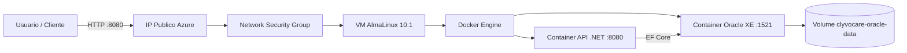

# ClyvoCare - API e Infraestrutura em Nuvem

Plataforma de monitoramento de saude animal com API REST em **ASP.NET Core 10**, persistencia em **Oracle** e implantacao via **Docker** e **Azure**.

Repositorio: https://github.com/GuuiSOares/clyvocare-devops

Video da entrega (demonstracao Azure CLI, Docker, CRUD e Oracle): https://youtu.be/dHmU2mMyS_o

---

## Descricao do projeto

A **ClyvoCare API** gerencia tutores (`Usuarios`), pets (`Pets`) e registros de saude (`LogsSaude`) coletados por sensores/IoT. A aplicacao utiliza **Entity Framework Core** com **Oracle Database** e pode ser executada localmente ou em uma **VM Linux (AlmaLinux) na Azure** por meio de **Docker Compose** e scripts **Azure CLI**.

Codigo da API: [`ChallengeNET-main/`](ChallengeNET-main/)

---

## Beneficios para o negocio

| Beneficio | Impacto |
|-----------|---------|
| Monitoramento continuo de pets | Deteccao precoce de febre, perda de peso e anomalias |
| Historico estruturado (TB_CC_LOG_SAUDE) | Base para dashboards e modelos de Machine Learning |
| API desacoplada | Integracao com apps mobile, clinicas e dispositivos IoT |
| Deploy em nuvem com containers | Ambiente reproduzivel para homologacao e producao |
| Persistencia Oracle com volume Docker | Dados mantidos apos reinicio dos containers |

---

## Arquitetura macro



| Componente | Detalhe |
|------------|---------|
| Regiao Azure | **Canada Central** (`canadacentral`) |
| Resource Group | `rg-clyvo-cc` |
| VM | `vm-clyvo-app` — **Standard_B2ls_v2** |
| Sistema operacional | **AlmaLinux 10.1** |
| API | ASP.NET Core 10 — container `clyvocare-api` (usuario `appuser`) |
| Banco | Oracle XE `gvenzl/oracle-xe` — container `clyvocare-oracle` |
| Orquestracao | Docker Compose (`docker compose up -d`) |
| Persistencia | Volume nomeado `clyvocare-oracle-data` |
| Portas expostas | **8080** (API/Swagger), **1521** (Oracle), **22** (SSH) |

---

## Rotas da API

### Usuarios (tutores) — CRUD

| Metodo | Rota |
|--------|------|
| GET | `/api/Usuarios` |
| GET | `/api/Usuarios/{id}` |
| POST | `/api/Usuarios` |
| PUT | `/api/Usuarios/{id}` |
| DELETE | `/api/Usuarios/{id}` |

### Pets — CRUD

| Metodo | Rota |
|--------|------|
| GET | `/api/Pets` |
| GET | `/api/Pets/{id}` |
| GET | `/api/Pets/especie/{especie}` |
| GET | `/api/Pets/tutor/{usuarioId}` |
| GET | `/api/Pets/busca/{nome}` |
| POST | `/api/Pets` |
| PUT | `/api/Pets/{id}` |
| DELETE | `/api/Pets/{id}` |

### Logs de saude

| Metodo | Rota |
|--------|------|
| GET | `/api/LogsSaude` |
| GET | `/api/LogsSaude/pet/{petId}` |
| POST | `/api/LogsSaude` |

Documentacao interativa: `http://<host>:8080/swagger`  
Health check: `http://<host>:8080/health`

Dados iniciais no banco (seed): tutor **Carlos Andrade**, pet **Thor**, log de saude de exemplo.

---

## Instalacao e execucao (How to)

### Pre-requisitos

- [Docker Desktop](https://www.docker.com/products/docker-desktop/)
- [Azure CLI](https://learn.microsoft.com/cli/azure/install-azure-cli) (`az login`)
- [Git](https://git-scm.com/) (para scripts `.sh` no Windows use Git Bash)
- [.NET 10 SDK](https://dotnet.microsoft.com/download) (opcional, build local sem Docker)

### Ambiente local (Docker)

Na raiz do repositorio:

```bash
docker compose up -d --build
docker compose ps
```

Na primeira execucao, aguarde a inicializacao do Oracle XE (pode levar alguns minutos).

```bash
curl http://localhost:8080/health
curl http://localhost:8080/api/Usuarios
```

Swagger: http://localhost:8080/swagger

Consultas no banco:

```bash
docker exec -it clyvocare-oracle sqlplus clyvocare/ClyvoCare_App_Pwd1@XEPDB1
```

Exemplos SQL:

```sql
SELECT * FROM TB_CC_USUARIO;
SELECT * FROM TB_CC_PET;
SELECT * FROM TB_CC_LOG_SAUDE ORDER BY ID_LOG DESC;
```

### Azure — provisionar infraestrutura (script CLI)

```bash
bash azure/provision-vm.sh
```

Configuracao padrao do script:

| Variavel | Valor padrao |
|----------|----------------|
| Resource Group | `rg-clyvo-cc` |
| Regiao | `canadacentral` |
| VM | `vm-clyvo-app` |
| Tamanho | `Standard_B2ls_v2` |
| SO (imagem) | AlmaLinux 10.1 |
| Usuario VM | `admlnx` |

Portas liberadas: **22** (SSH), **8080** (API), **1521** (Oracle).

Se a Azure nao tiver vaga no tamanho padrao: `SIZE=Standard_B2ats_v2 bash azure/provision-vm.sh`

### Azure — publicar aplicacao

```bash
bash azure/deploy-app.sh
```

Apos o deploy, use o IP gravado em `azure/vm-info.env` (nao vai para o GitHub):

- Swagger: `http://<IP-VM>:8080/swagger`
- API: `http://<IP-VM>:8080/api/Usuarios`

### Azure — remover recursos

```bash
bash azure/cleanup-vm.sh
```

---

## Docker

| Arquivo | Descricao |
|---------|-----------|
| [`Dockerfile`](Dockerfile) | Build da API .NET 10; execucao com usuario `appuser` (nao-root) |
| [`docker-compose.yml`](docker-compose.yml) | API + Oracle XE; volume `clyvocare-oracle-data`; execucao em background |

```bash
docker compose up -d --build
docker volume inspect clyvocare-oracle-data
docker compose ps
```

---

## Scripts Azure CLI

| Script | Descricao |
|--------|-----------|
| [`azure/provision-vm.sh`](azure/provision-vm.sh) | Resource Group, VM AlmaLinux, portas e Docker |
| [`azure/deploy-app.sh`](azure/deploy-app.sh) | Clone do GitHub e `docker compose up -d --build` |
| [`azure/cleanup-vm.sh`](azure/cleanup-vm.sh) | Exclusao do Resource Group |

---

## Equipe

| RM | Nome |
|----|------|
| 562673 | Geovanne Coneglian Passos |
| 563960 | Lucas Silva Gastao Pinheiro |
| 563143 | Guilherme Soares De Almeida |

---

## Estrutura do repositorio

```
.
├── ChallengeNET-main/                     # Codigo da API .NET
├── azure/                                 # Scripts Azure CLI
├── Dockerfile
├── docker-compose.yml
└── README.md
```
