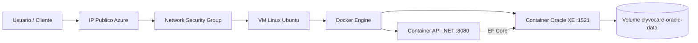

# ClyvoCare - API e Infraestrutura em Nuvem

Plataforma de monitoramento de saude animal com API REST em **ASP.NET Core 10**, persistencia em **Oracle** e implantacao via **Docker** e **Azure**.

---

## Descricao do projeto

A **ClyvoCare API** gerencia tutores (`Usuarios`), pets (`Pets`) e registros de saude (`LogsSaude`) coletados por sensores/IoT. A aplicacao utiliza **Entity Framework Core** com **Oracle Database** e pode ser executada localmente ou em uma **VM Linux na Azure** por meio de **Docker Compose** e scripts **Azure CLI**.

Codigo da API: [`ChallengeNET-main/ChallengeNET-main/`](ChallengeNET-main/ChallengeNET-main/)

---

## Beneficios para o negocio

| Beneficio | Impacto |
|-----------|---------|
| Monitoramento continuo de pets | Deteccao precoce de febre, perda de peso e anomalias |
| Historico estruturado (TB_CC_LOG_SAUDE) | Base para dashboards e modelos de Machine Learning |
| API desacoplada | Integracao com apps mobile, clinicas e dispositivos IoT |
| Deploy em nuvem com containers | Ambiente reproduzivel para homologacao e producao |
| Persistencia Oracle com volume Docker | Dados mantidos apos reinicio dos containers |

---

## Arquitetura macro



| Camada | Tecnologia |
|--------|------------|
| API | ASP.NET Core 10 - ClyvoCare.API |
| Banco | Oracle XE (`gvenzl/oracle-xe`) |
| Orquestracao | Docker Compose |
| Infraestrutura | Azure VM, NSG, IP publico |

- API e banco em containers separados
- Persistencia via volume Docker `clyvocare-oracle-data`
- API executada com usuario `appuser` (sem privilegios de root)
- Portas: **8080** (API), **1521** (Oracle)

---

## Rotas da API

### Usuarios (tutores)

| Metodo | Rota |
|--------|------|
| GET | `/api/Usuarios` |
| GET | `/api/Usuarios/{id}` |
| POST | `/api/Usuarios` |
| PUT | `/api/Usuarios/{id}` |
| DELETE | `/api/Usuarios/{id}` |

### Pets

| Metodo | Rota |
|--------|------|
| GET | `/api/Pets` |
| GET | `/api/Pets/{id}` |
| GET | `/api/Pets/especie/{especie}` |
| GET | `/api/Pets/tutor/{usuarioId}` |
| GET | `/api/Pets/busca/{nome}` |
| POST | `/api/Pets` |
| PUT | `/api/Pets/{id}` |
| DELETE | `/api/Pets/{id}` |

### Logs de saude

| Metodo | Rota |
|--------|------|
| GET | `/api/LogsSaude` |
| GET | `/api/LogsSaude/pet/{petId}` |
| POST | `/api/LogsSaude` |

Documentacao interativa: `http://<host>:8080/swagger`  
Health check: `http://<host>:8080/health`

---

## Instalacao e execucao

### Pre-requisitos

- [Docker Desktop](https://www.docker.com/products/docker-desktop/)
- [Azure CLI](https://learn.microsoft.com/cli/azure/install-azure-cli) (`az login`)
- [.NET 10 SDK](https://dotnet.microsoft.com/download) (opcional, para desenvolvimento local sem Docker)

### Ambiente local (Docker)

Na raiz do repositorio:

```bash
docker compose up -d --build
docker compose ps
```

Na primeira execucao, aguarde a inicializacao do Oracle XE (pode levar alguns minutos).

```bash
curl http://localhost:8080/health
curl http://localhost:8080/api/Usuarios
```

Swagger: http://localhost:8080/swagger

Consultas no banco:

```bash
docker exec -it clyvocare-oracle sqlplus clyvocare/ClyvoCare_App_Pwd1@XEPDB1
```

### Azure - provisionar infraestrutura

```bash
bash azure/provision-vm.sh
```

Variaveis padrao: `rg-clyvo-cc`, `eastus`, `vm-clyvo-app`, usuario `admlnx`.  
Portas liberadas: **8080** (API), **1521** (Oracle), **22** (SSH).

### Azure - publicar aplicacao

```bash
REPO_URL=https://github.com/USUARIO/REPO.git bash azure/deploy-app.sh
```

Apos o deploy, teste em `http://<IP-VM>:8080/swagger`.

### Azure - remover recursos

```bash
bash azure/cleanup-vm.sh
```

---

## Docker

| Arquivo | Descricao |
|---------|-----------|
| [`Dockerfile`](Dockerfile) | Imagem da API (.NET 10, usuario `appuser`) |
| [`docker-compose.yml`](docker-compose.yml) | API + Oracle XE, volume `clyvocare-oracle-data` |

```bash
docker compose up -d --build
docker volume inspect clyvocare-oracle-data
```

---

## Scripts Azure CLI

| Script | Descricao |
|--------|-----------|
| [`azure/provision-vm.sh`](azure/provision-vm.sh) | Resource Group, VM, portas, Docker e ferramentas |
| [`azure/deploy-app.sh`](azure/deploy-app.sh) | Clone do repositorio e `docker compose up -d` |
| [`azure/cleanup-vm.sh`](azure/cleanup-vm.sh) | Exclusao do Resource Group |

---

## Desenvolvimento local (Oracle externo)

Para apontar a API a um Oracle fora do Docker, use User Secrets:

```bash
cd ChallengeNET-main/ChallengeNET-main
dotnet user-secrets set "ConnectionStrings:OracleConnection" "SUA_CONNECTION_STRING"
```

---

## Equipe

| RM | Nome |
|----|------|
| 562673 | Geovanne Coneglian Passos |
| 563960 | Lucas Silva Gastao Pinheiro |
| 563143 | Guilherme Soares De Almeida |

---

## Estrutura do repositorio

```
.
├── ChallengeNET-main/ChallengeNET-main/   # Codigo da API
├── azure/                                 # Automacao Azure CLI
├── Dockerfile
├── docker-compose.yml
└── README.md
```
